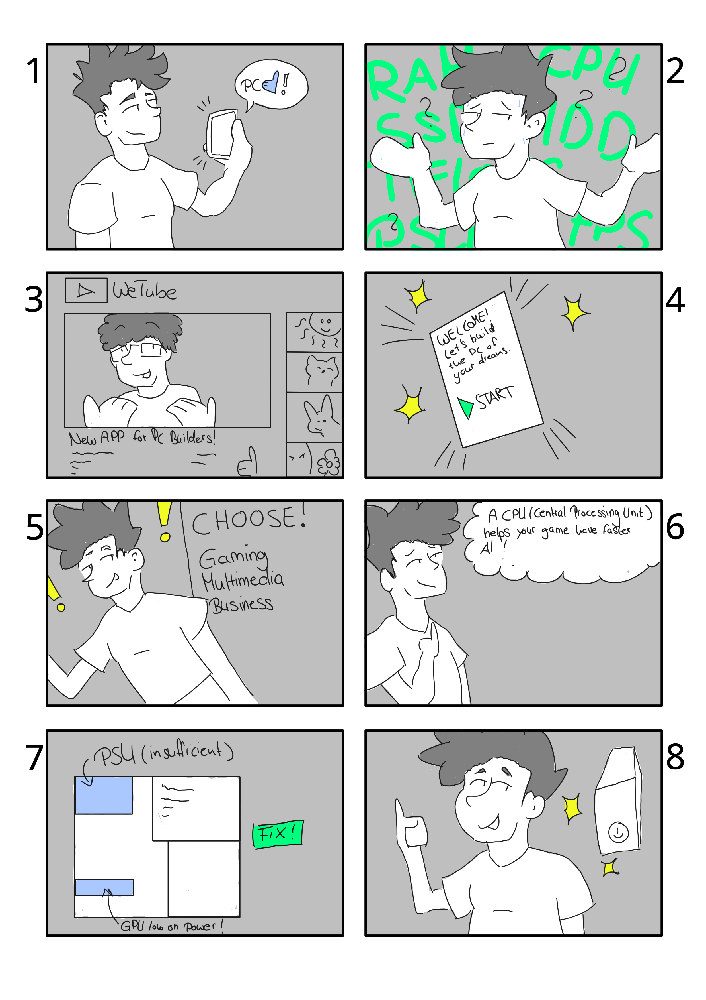

# Projektvorschläge zum Kurs UX-Design 
Mitglieder: 
- Julia
- Daniel
- Nils

## Pitch 3 “PC-Anleitung”
PC-Erstbauer bekommen eine Anleitung, wie man einen Desktop zusammenstellt und die einzelnen Kabel und Komponenten verbindet. Diese Anleitung kommt mit Information zu den Komponenten sowie Dinge, auf die man achten muss. Der User kann die Spezifikation selbst auswählen.

---

### Customer Journey anhand von Zack

#### 1
Zack erhält die Erlaubnis sich einen PC zu kaufen.
#### 2
Zack ist aufgrund des Angebots gnadenlos überfordert und weiß nicht wie er eine Informierte Entscheidung treffen kann.
#### 3
Zack lernt unsere App durch ein Feature in einem Video kennen.
#### 4
Zack lädt sich diese App herunter und startet diese.
#### 5
Durch die einfachen Einstellungen der App wird der Kaufprozess einfach und klar gegliedert.
#### 6
Bei unsicherheiten besteht die Option mehr informationen zu den Themen zu erhalten um mehr Informationen zu erhalten.
#### 7
Die App gibt Meldungen, wenn einige Sachen unstimmig sind um Fehler vorzubeugen.
#### 8
Durch die Hilfe konnte sich Zack seinen PC selbst bauen. 

## Pitch 1 “Humanity”:
Wir könnten versuchen, die Verbreitung des Menschen auf der Erde zu rekonstruieren und dies interaktiv gestalten indem wir ihm mehrmals die Option geben, wo sich die Bevölkerungsströme hinbewegen und das halt entsprechend mit Ereignissen unterstützt wird

Wir haben vor, die Wanderung des Menschen als interaktive Anwendung in Godot zu programmieren. Der Gedanke ist, dass wir die Verbreitung des Menschen auf dem Planeten mit einer Karte darstellen, wo entsprechende Informationen anklickbar sind. 

## Pitch 2 “the Big Boom”
Nachstellung des Tschornobyl-Unglücks als Visual Novel, in dem man den Reaktor-Operator steuert, welchen durch Text/Voice-Elemente unter Druck gesetzt wird und entsprechend die Reaktorsteuerung selbst bedienen muss. Es soll durch das visuelle und klangliche Erlebnis der psychische Druck nachgebildet werden. Die Entscheidungsfreiheit bleibt bei dem Nutzer, den Reaktor auch langsamer zu starten, jedoch wird halt entsprechend der Vorgesetzte saurer.

## Pitch 4 “Sonnensystem”
Wir wollen die einzelnen Planeten in unserem Sonnensystem maßstabgetreu abbilden. Der User kann auf die Planeten klicken und erhält spielerisch mehr Information. 

## Pitch 5 “Dinoturf”
Wir möchten das Erlebnis von Archäologen spieler darstellen, es sind in einem Gittermuster Fossile versteckt, welche man ausgraben soll. Nach dem Freilegen von einem können Informationen dazu angezeigt werden.  
Pitch ? "Postapokalypse"
Ein Brettspiel zum Wiederaufbau einer Zivilisation nach einer Katastrophe.

## Pitch 6 "Postapokalypse"
Ein Brettspiel zum Wiederaufbau einer Zivilisation nach einer Katastrophe. 
